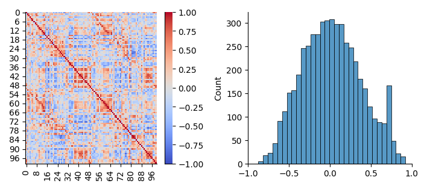
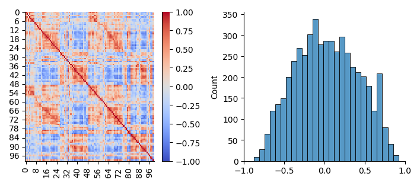
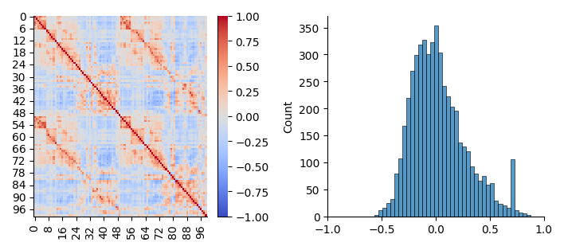

# juniplot
Make some plots from junifer output for initial inspection.

## Install

```
pip install git+https://github.com/LeSasse/juniplot.git
```

## Usage

Data used for these examples was obtained from the [AOMIC PIOP1 dataset](https://openneuro.org/datasets/ds002785/versions/2.0.0).

`juniplot` allows you to plot functional connectivity markers obtained in a
[junifer](https://juaml.github.io/junifer/main/index.html) pipeline. Importantly,
it works for [HDF5FeatureStorage](https://juaml.github.io/junifer/main/api/storage.html#junifer.storage.HDF5FeatureStorage) data only.

### Single Element
You can run `juniplot` on a single `element_*` file. Just specify the output path.
In addition you should use the `--single-output` flag. 
Optionally you can specify a [matplotlib colormap](https://matplotlib.org/stable/gallery/color/colormap_reference.html).

By default `juniplot` will save figures as `png` files, but using the `--format`
parameter, you can also save it as `pdf` or as `svg`.
For large datasets, `png` is likely the fastest, but `pdf` and `svg` of course
have the advantage, that they are scalable and therefore sharper overall.

To give it a try on some real data you can use the example provided at:
https://gin.g-node.org/LeSasse/juniplot-example

```
git clone https://gin.g-node.org/LeSasse/juniplot-example.git
cd juniplot-example
```

Run for a single element:
```
juniplot \
	aomic_piop1/element_0157_restingstate_aomic_piop1.hdf5 \
	plots/single \
	--cmap "coolwarm" \
	--single-output
```

The example plot may look as follows:


### Collected Elements

You can also set the `--n-jobs` parameter. This will run plotting for each
marker that you defined in your junifer yaml separately. Keep in mind, that depending
on the size of your dataset, this can take some time.

`juniplot` will make a figure for every subject, every marker of that subject,
and then also a group average for each marker. Group averages are derived
by `Fisher's r-to-z transform`, then averaging, and then `z-to-r` transforming
back the average.

Run for the collected file:
```
juniplot \
	aomic_piop1/aomic_piop1.hdf5 \
	plots/group \
	--cmap "coolwarm" \
	--n-jobs 16
```

An example of one of the individual subjects from this one can look as follows:


An example of some group average data looks as follows:


If you want to avoid running all subjects and are only interested in the group average
plot you can also use the `--average-only` flag. This will then only plot the group
average matrices.


```
juniplot \
	aomic_piop1/aomic_piop1.hdf5 \
	plots/group \
	--cmap "coolwarm" \
	--average-only
```
